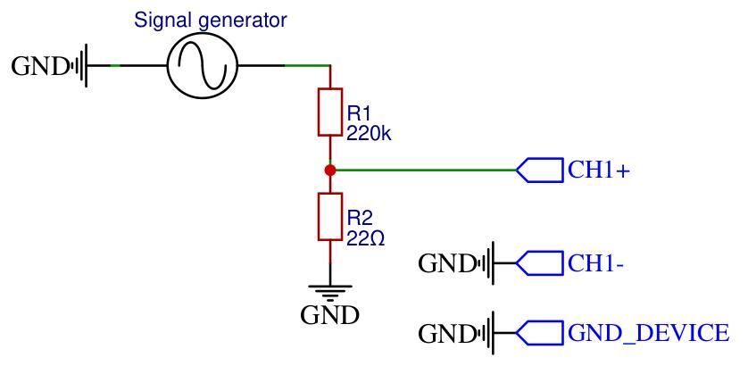
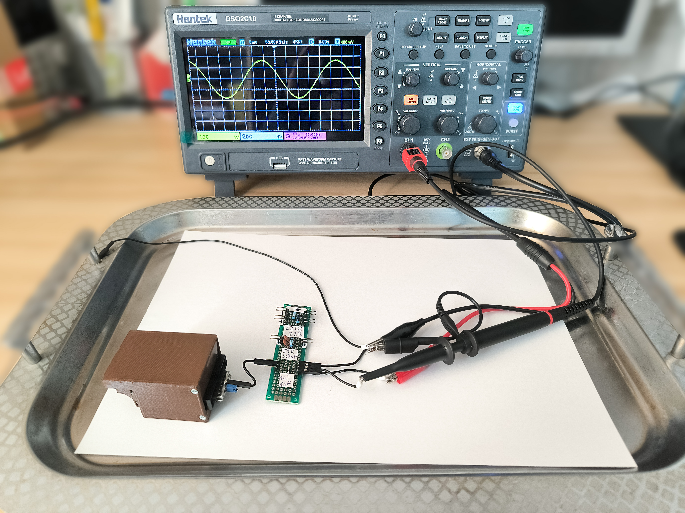
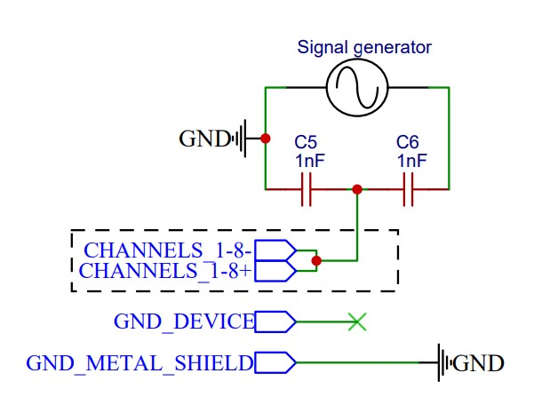
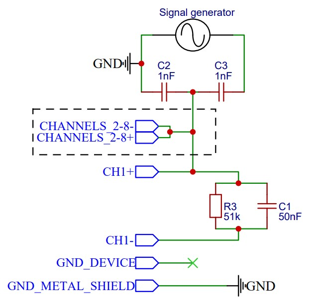
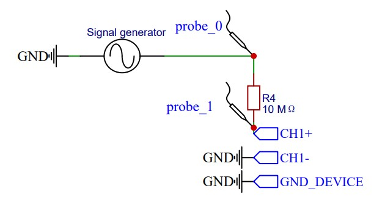
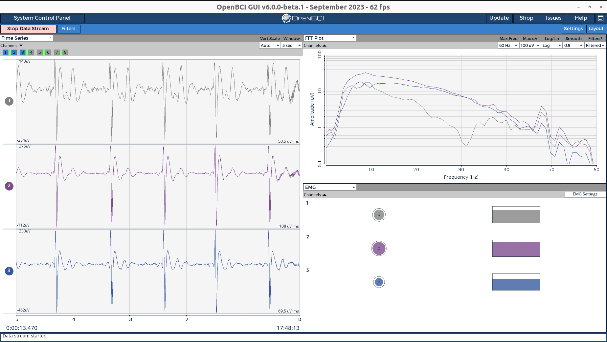

# BioListener - Evaluation

This BioListener evaluation repository contains the necessary code, programs, data records, and experimental setups required for evaluating BioListener main board parameters and performing real-world demonstrations.

<p align="center">
  
</p>

## Boards Evaluated

Boards evaluated are based on:
- ADC AD7771 (Analog Devices)
- ADC ADS131M08 (Texas Instruments)

### Parameters Evaluated

The evaluation covers key parameters:
- **Input Referred Noise (IRN)**
- **Frequency Response**
- **Signal to Noise Ratio (SNR)**
- **Common Mode Rejection Ratio (CMRR)**
  - Balance test
  - Imbalance test
- **Inputs impedance**

### Experimental Setups for Real-World Evaluation

- **Electromyography (EMG)**: Fist Clenching
- **Electrocardiography (ECG)**: 1 Lead
- **Electrocardiography (ECG)**: 5 Lead
- **Electroencephalography (EEG) and EMG**: Alpha Brain Wave and Eye Blink Detection

## Usage examples
Ensure the board is connected to the same WiFi network as the device running the BrainFlow server.  
**Default port**: `12345`  
The server listens on all interfaces by default.  


### Measure Data Frequency
To measure data frequency (in Hz) of data received from BioListener board:
```shell
python measure_brainflow_data_frequency.py
```

### Plot Data in Real-Time
To plot data in real time, with recording interface available:
```shell
python plot_real_time_with_recording.py
```

### OpenBCI GUI
To bind to OpenBCI GUI, use previous command. The streaming board is created at  
`streaming_board://225.1.1.1:6677`  
_Note_: Customized OpenBCI GUI is required. Future integration with the official GUI is planned.

## Boards evaluation
Evaluation scripts are located in `biolistener_evaluation` directory.  
See [biolistener_evaluation.ipynb](biolistener_evaluation.ipynb) for detailed evaluation results.

**Evaluation Data**: Located in the `data` directory.

> [!NOTE]
> Take note! The following Boards evaluation plots, descriptions, data is **Work In Progress** and will be moved in the future to the Jupiter Notebook and described fully. At the moment, only short descriptions are provided. Stay tuned!

| Equipment                                                      | Description and Images                                                                                                         |
|----------------------------------------------------------------|--------------------------------------------------------------------------------------------------------------------------------|
| Hantek DSO2C10 Digital Storage Oscilloscope                    | Has built-in signals generator (oscilloscope was updated to DSO2D15 firmware)                                                  |
| Hantek PP-150 100MHz 1:1 / 10:1 Oscilloscope Probes            |                                                                                                                                |
| Fnirsi P4100 100MHz 100:1 Oscilloscope Probes                  | High impedance probe                                                                                                           |
| Custom connectors, cables, and adapters                        |                                                                                                                                |
| Evaluation Helper PCB with soldered on test specific circuitry |                                                                                                                                |
| Golden Cup Passive Electrodes, ECG/EEG Gel                     |  |
| Snap Patch Passive Electrodes                                  |               |


### Evaluation setups
The following test setups were used for evaluation:
#### Input Referred Noise (IRN)


All the input ADC channels were shorted together and with device ground.

#### Frequency Response


<p align="center">
  
</p>

#### Signal to Noise Ratio (SNR)
Calculated on data collected during Frequency Response test.

#### Common Mode Rejection Ratio (CMRR) Balance


<p align="center">
  
</p>


#### Common Mode Rejection Ratio (CMRR) Imbalance


<p align="center">
  
</p>

#### Inputs impedance


<p align="center">
  
</p>

### Evaluation results
**See [biolistener_evaluation.ipynb](biolistener_evaluation.ipynb) for detailed evaluation results.**

### Real-world Evaluation setups

#### EMG - Fist Clenching
Channel 1 is used. All other channels are disabled. Preferable electrodes for this setup are Snap Patch Passive Electrodes (though Golden Cup Passive Electrodes can be used as well, and they were mainly used for this test setup).


#### ECG - 1 Lead
Standard ECG 1 lead setup.

#### ECG - 5 Lead
Standard ECG 5 lead setup.

#### EEG, EMG - Alpha Brain Wave, Eye Blink


### ADC AD7771 (Analog Devices)

#### EMG - Fist Clenching
Channel 1 is used. All other channels are disabled.


#### ECG - 1 Lead


#### ECG - 5 Lead



#### EEG, EMG - Alpha Brain Wave, Eye Blink


### ADC ADS131M08 (Texas Instruments)

#### EMG - Fist Clenching


#### ECG - 1 Lead


#### ECG - 5 Lead


#### EEG, EMG - Alpha Brain Wave, Eye Blink


## Useful commands
To check active sockets on port **12345**:
```shell
sudo netstat -tulnap | grep 12345
```

To clear busy sockets:
```shell
sudo ./busy_sockets_clear.sh
```

## License

This repository uses the following licenses:

- **Code**: The code in this repository is licensed under the [GNU General Public License v3.0 (GPL-3.0)](https://www.gnu.org/licenses/gpl-3.0.html).
  
- **Experimental Data**: The experimental data (e.g., images, data records) is licensed under the [Creative Commons Attribution 4.0 International (CC BY 4.0)](https://creativecommons.org/licenses/by/4.0/).
