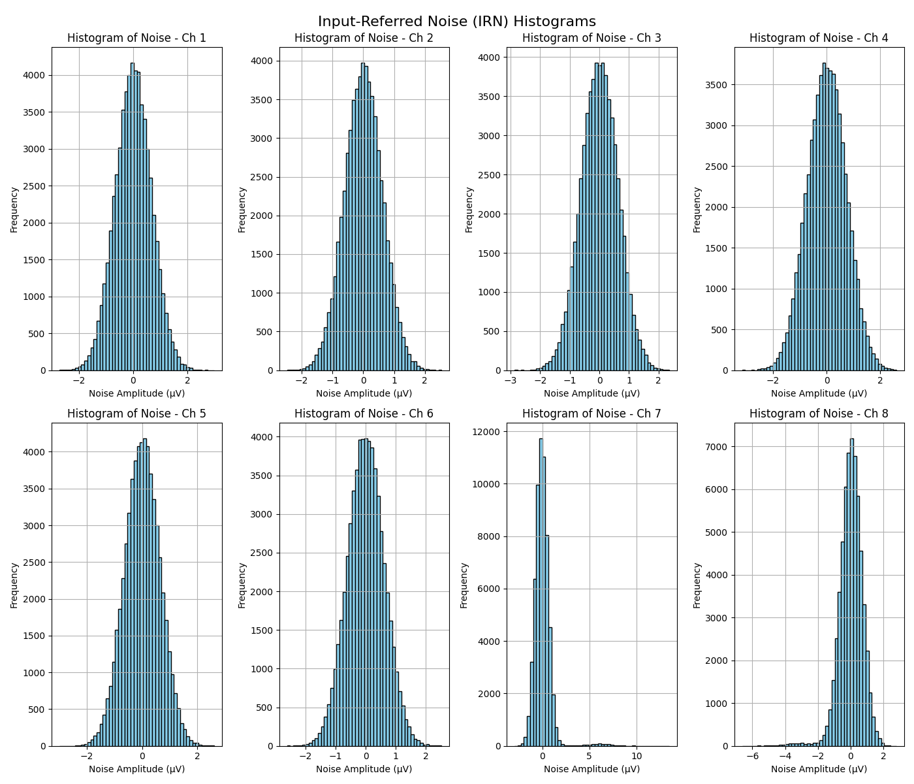

# BioListener - Evaluation

This BioListener evaluation repository contains the necessary code, programs, data records, and experimental setups required for evaluating BioListener main board parameters and performing real-world demonstrations.

<p align="center">
  
</p>

## Boards Evaluated

Boards evaluated are based on:
- ADC AD7771 (Analog Devices)
- ADC ADS131M08 (Texas Instruments)

### Parameters Evaluated

The evaluation covers key parameters:
- **Input Referred Noise (IRN)**
- **Frequency Response**
- **Signal to Noise Ratio (SNR)**
- **Common Mode Rejection Ratio (CMRR)**
  - Balance test
  - Imbalance test
- **Inputs impedance**

### Experimental Setups for Real-World Evaluation

- **Electromyography (EMG)**: Fist Clenching
- **Electrocardiography (ECG)**: 1 Lead
- **Electrocardiography (ECG)**: 5 Lead
- **Electroencephalography (EEG) and EMG**: Alpha Brain Wave and Eye Blink Detection

## Usage examples
Ensure the board is connected to the same WiFi network as the device running the BrainFlow server.  
**Default port**: `12345`  
The server listens on all interfaces by default.  


### Measure Data Frequency
To measure data frequency (in Hz) of data received from BioListener board:
```shell
python measure_brainflow_data_frequency.py
```

### Plot Data in Real-Time
To plot data in real time, with recording interface available:
```shell
python plot_real_time_with_recording.py
```

### OpenBCI GUI
To bind to OpenBCI GUI, use previous command. The streaming board is created at  
`streaming_board://225.1.1.1:6677`  
_Note_: Customized OpenBCI GUI is required. Future integration with the official GUI is planned.

## Boards evaluation
Evaluation scripts are located in `biolistener_evaluation` directory. They will be combined in Jupiter Notebook in the future.  
**Evaluation Data**: Located in the `data` directory.

> [!NOTE]
> Take note! The following Boards evaluation plots, descriptions, data is **Work In Progress** and will be moved in the future to the Jupiter Notebook and described fully. At the moment, only short descriptions are provided. Stay tuned!

| Equipment                                                      | Description and Images                                                                                                         |
|----------------------------------------------------------------|--------------------------------------------------------------------------------------------------------------------------------|
| Hantek DSO2C10 Digital Storage Oscilloscope                    | Has built-in signals generator (oscilloscope was updated to DSO2D15 firmware)                                                  |
| Hantek PP-150 100MHz 1:1 / 10:1 Oscilloscope Probes            |                                                                                                                                |
| Fnirsi P4100 100MHz 100:1 Oscilloscope Probes                  | High impedance probe                                                                                                           |
| Custom connectors, cables, and adapters                        |                                                                                                                                |
| Evaluation Helper PCB with soldered on test specific circuitry |                                                                                                                                |
| Golden Cup Passive Electrodes, ECG/EEG Gel                     |  |
| Snap Patch Passive Electrodes                                  |               |


### Evaluation setups
The following test setups were used for evaluation:
#### Input Referred Noise (IRN)


#### Frequency Response


#### Signal to Noise Ratio (SNR)
Calculated on data collected during Frequency Response test.

#### Common Mode Rejection Ratio (CMRR)


#### Inputs impedance


### ADC AD7771 (Analog Devices)

#### Input Referred Noise (IRN)

```text
Input-Referred Noise (IRN) for each channel:
1: Accurate = 5.178154 µV, STD ±3σ (99.73%) = 1.990201 µV
2: Accurate = 2.346933 µV, STD ±3σ (99.73%) = 1.722421 µV
3: Accurate = 2.458692 µV, STD ±3σ (99.73%) = 1.689134 µV
4: Accurate = 2.458692 µV, STD ±3σ (99.73%) = 1.647123 µV
5: Accurate = 2.458691 µV, STD ±3σ (99.73%) = 1.678384 µV
6: Accurate = 3.091991 µV, STD ±3σ (99.73%) = 1.756075 µV
7: Accurate = 3.539025 µV, STD ±3σ (99.73%) = 1.789343 µV
8: Accurate = 2.868473 µV, STD ±3σ (99.73%) = 1.614539 µV
```

<p align="center">
  
</p>

Short summary: IRN (STD ±3σ 99.73%) is below 2uV for all channels, this is a good result.

#### Frequency Response

<p align="center">
  
</p>

Short summary: Frequency response is within the range required by regulations for EEG and ECG (thus for all other common biomedical applications as well).

#### Signal to Noise Ratio (SNR)

<p align="center">
  
</p>

Short summary: SNR is great, comparable to costly EEG devices.

#### Common Mode Rejection Ratio (CMRR) - Balance test
Short summary: CMRR balance test results are great, above measurable with common equipment. Professional equipment is needed to measure this parameter.

#### Common Mode Rejection Ratio (CMRR) - Imbalance test

<p align="center">
  
</p>

Short summary: CMRR is great for all common biomedical applications.

#### Inputs impedance
More than 10MOhm.

### ADC ADS131M08 (Texas Instruments)

#### Input Referred Noise (IRN)

```text
Input-Referred Noise (IRN) for each channel:
1: Accurate = 5.697458 µV, STD ±3σ (99.73%) = 3.985850 µV
2: Accurate = 5.016849 µV, STD ±3σ (99.73%) = 3.671722 µV
3: Accurate = 5.218014 µV, STD ±3σ (99.73%) = 3.761913 µV
4: Accurate = 5.764514 µV, STD ±3σ (99.73%) = 4.334074 µV
5: Accurate = 5.577877 µV, STD ±3σ (99.73%) = 3.818711 µV
6: Accurate = 5.125255 µV, STD ±3σ (99.73%) = 3.635233 µV
7: Accurate = 16.415119 µV, STD ±3σ (99.73%) = 5.686473 µV
8: Accurate = 9.433552 µV, STD ±3σ (99.73%) = 4.317976 µV
```

<p align="center">
  
</p>

Short summary: IRN (STD ±3σ 99.73%) is below 6uV for all channels, this is a bit worse than AD7771, but still OK for most applications.


#### Frequency Response

<p align="center">
  
</p>

Short summary: Frequency response is within the range required by regulations for EEG and ECG (thus for all other common biomedical applications as well).

#### Signal to Noise Ratio (SNR)

<p align="center">
  
</p>

Short summary: SNR is great, comparable to costly EEG devices.

#### Common Mode Rejection Ratio (CMRR) - Balance test
Short summary: CMRR balance test results are great, above measurable with common equipment. Professional equipment is needed to measure this parameter.

#### Common Mode Rejection Ratio (CMRR) - Imbalance test

<p align="center">
  
</p>

Short summary: CMRR is great for all common biomedical applications.

#### Inputs impedance
1.25-1.5MOhm on 8x-128x gain.

## Real-world evaluation

### Real-world Evaluation setups

#### EMG - Fist Clenching
Channel 1 is used. All other channels are disabled. Preferable electrodes for this setup are Snap Patch Passive Electrodes (though Golden Cup Passive Electrodes can be used as well, and they were mainly used for this test setup).


#### ECG - 1 Lead
Standard ECG 1 lead setup.

#### ECG - 5 Lead
Standard ECG 5 lead setup.

#### EEG, EMG - Alpha Brain Wave, Eye Blink


### ADC AD7771 (Analog Devices)

#### EMG - Fist Clenching
Channel 1 is used. All other channels are disabled.


#### ECG - 1 Lead


#### ECG - 5 Lead


#### EEG, EMG - Alpha Brain Wave, Eye Blink


### ADC ADS131M08 (Texas Instruments)

#### EMG - Fist Clenching


#### ECG - 1 Lead


#### ECG - 5 Lead


#### EEG, EMG - Alpha Brain Wave, Eye Blink


## Useful commands
To check active sockets on port **12345**:
```shell
sudo netstat -tulnap | grep 12345
```

To clear busy sockets:
```shell
sudo ./busy_sockets_clear.sh
```

## License

This repository uses the following licenses:

- **Code**: The code in this repository is licensed under the [GNU General Public License v3.0 (GPL-3.0)](https://www.gnu.org/licenses/gpl-3.0.html).
  
- **Experimental Data**: The experimental data (e.g., images, data records) is licensed under the [Creative Commons Attribution 4.0 International (CC BY 4.0)](https://creativecommons.org/licenses/by/4.0/).
